# 🛡️ FraudGuard - AI Powered Fraud Detection Platform


> An end-to-end AI fraud detection platform built with Machine Learning, FastAPI, React, PostgreSQL and Human Approval workflows.


---

# 🌐 Live Demo


🚀 Application:

https://fraudguard-434w.onrender.com/login


📄 Project Report:

https://marvinvutshila.github.io/fraudguard-reports/


---

# 🚀 Overview

FraudGuard is a banking fraud detection system that uses an XGBoost machine learning model to analyse transactions and classify them as:

- ✅ Approved
- ⚖️ Human Review
- 🚫 Blocked


The platform provides:

- Real-time fraud monitoring
- Transaction prediction
- Batch analysis
- Human review workflow
- Audit tracking
- Admin management
- Machine learning insights


---

# 📸 Application Screenshots


## 🔐 Login Page

JWT authentication with secure user access.


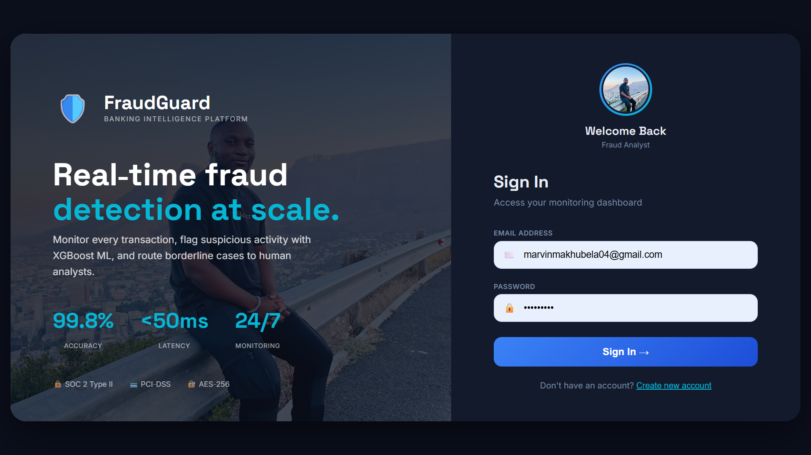


---

# 📊 Main Dashboard

Real-time transaction monitoring and fraud analytics.


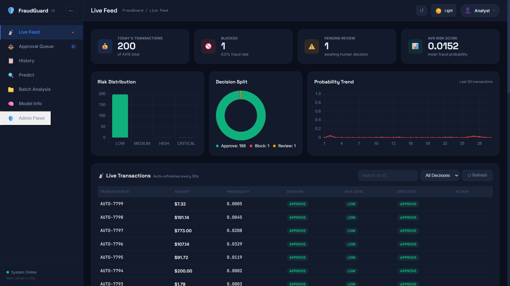


---

# ⚖️ Human Approval Queue

Analysts review suspicious transactions.


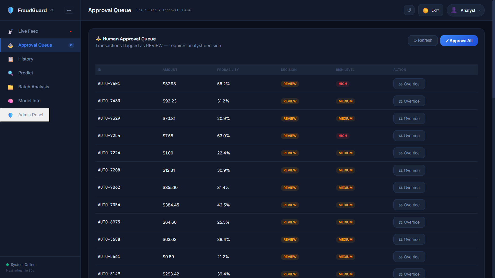


---

# 📝 Approval Audit

Complete history of approval decisions.


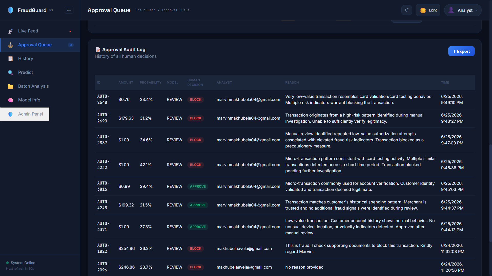


---

# 📋 Transaction History

Search and filter all processed transactions.


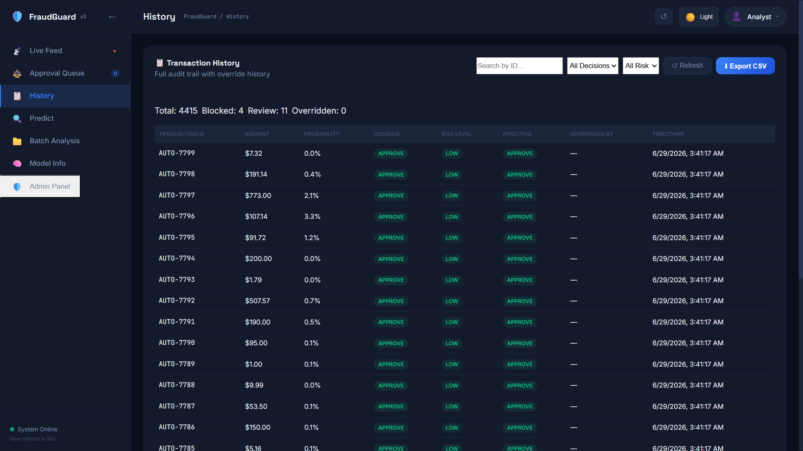


---

# 🔍 Single Transaction Prediction

Predict fraud probability for a transaction.


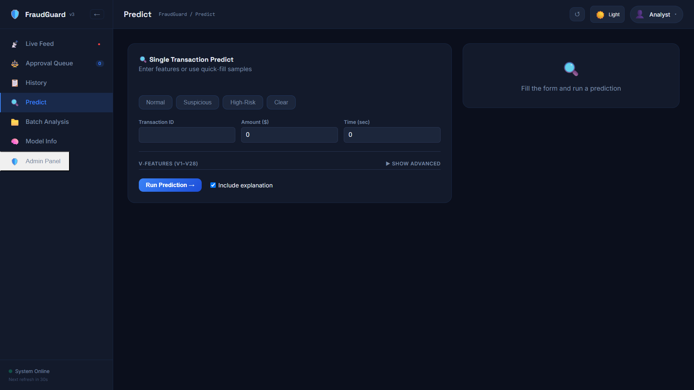


---

# 📁 Batch Transaction Analysis

Upload CSV files and analyse multiple transactions.


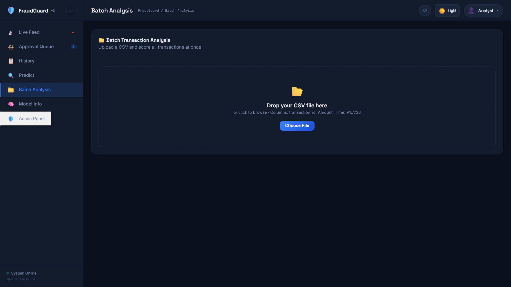


---

# 🧠 Machine Learning Model Information


View model metrics and feature importance.


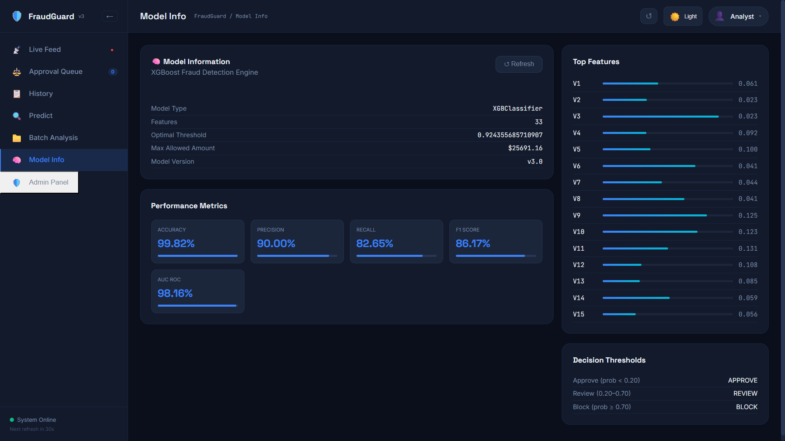


---

# 🛡️ Admin Control Centre


## Admin Dashboard


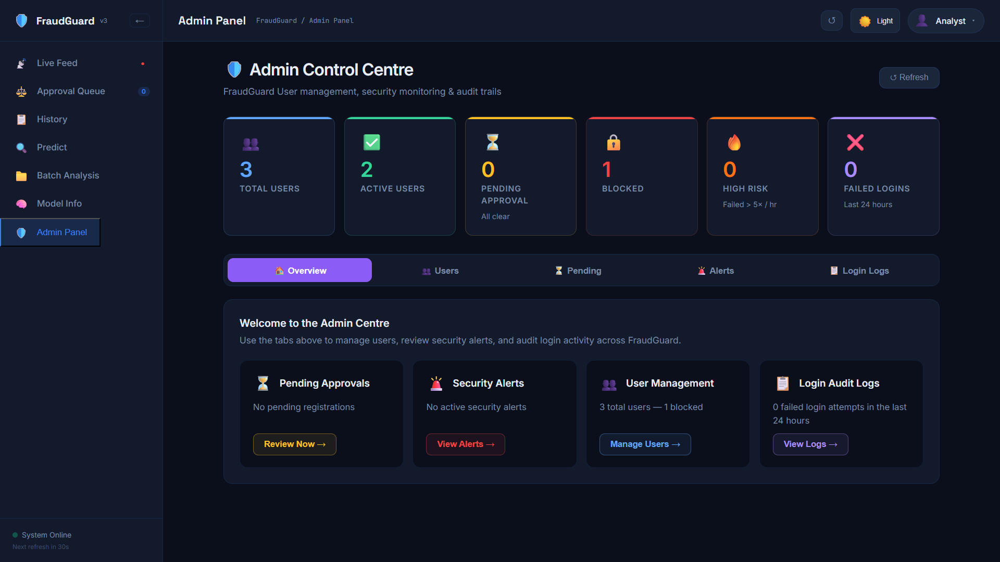


## User Management


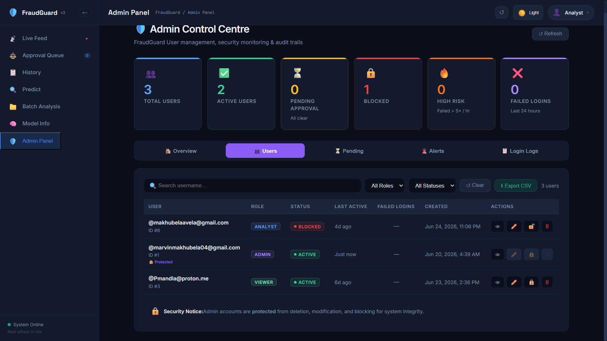


## Login Audit Logs


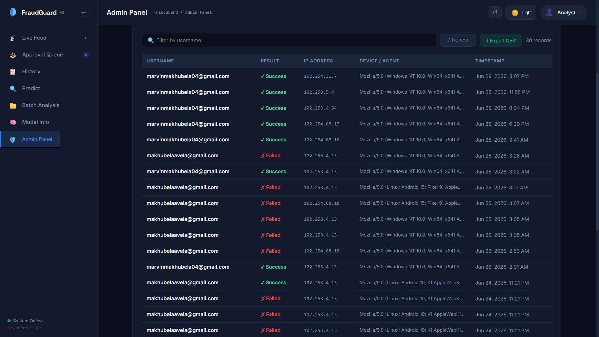


## User Activity Monitoring


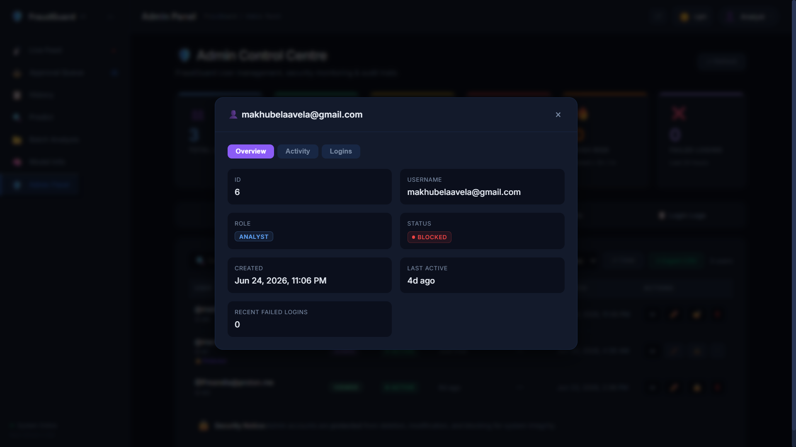


---

# ✨ Features


## 🤖 Machine Learning

- XGBoost Fraud Detection
- Feature Engineering
- Fraud Probability Prediction
- Risk Classification
- Model Evaluation
- Explainable AI Support


---

## 📡 Monitoring

- Live transaction monitoring
- Fraud scoring
- Risk levels
- Dashboard analytics
- Filtering


---

## ⚖️ Human Review Workflow

- Suspicious transaction queue
- Approve transactions
- Block transactions
- Analyst comments
- Audit history


---

## 📁 Batch Processing

Supports:

- CSV uploads
- Large transaction processing
- Fraud scoring
- Decision generation


---

## 🔐 Security

Implemented:

- JWT Authentication
- Password hashing
- Role Based Access Control
- Protected admin routes
- Audit logging


---

# 🏗️ Architecture


```
                 React Frontend

                       |

                       |

                  FastAPI API

                       |

        --------------------------------

        |              |               |

        |              |               |

     XGBoost       PostgreSQL       JWT

    ML Model       Database       Security

```


---

# 🧠 Machine Learning Pipeline


```
Transaction Data

        |

        v

Feature Engineering

        |

        v

XGBoost Model

        |

        v

Fraud Probability

        |

        v

Decision Engine

        |

        v

React Dashboard

```


---

# 🛠️ Technology Stack


## Frontend

- React
- Vite
- JavaScript
- CSS


## Backend

- FastAPI
- Python
- SQLAlchemy


## Database

- PostgreSQL


## Machine Learning

- XGBoost
- Scikit-learn
- Pandas
- NumPy


## Deployment

- Docker
- GitHub Actions


---

# 📂 Project Structure


```
FraudGuard

│
├── fraud_detection/

├── frontend/

├── models_store/

├── tests/

│
├── data/

│   ├── loginPage.png

│   ├── dashboard.png

│   ├── HumanApproval.png

│   ├── ApprovalAudit.png

│   ├── TransactionHistory.png

│   ├── SingleTransactionPredict.png

│   ├── BatchTransactionAnalysis.png

│   ├── ModelInformation.png

│   ├── AdminControlCentre.png

│   ├── AdminControlCentre1.png

│   ├── AdminControlCentre2.png

│   └── AdminControlCentre3.png

│
├── main.py

├── train.py

├── requirements.txt

└── README.md

```


---

# ⚙️ Installation


Clone:

```bash
git clone https://github.com/YOUR_USERNAME/FraudGuard.git

cd FraudGuard
```


Install backend:

```bash
pip install -r requirements.txt
```


Install frontend:

```bash
cd frontend

npm install
```


---

# ▶️ Run Application


Backend:

```bash
python main.py
```


Frontend:

```bash
npm run dev
```


API:

```
http://localhost:8000/docs
```


Frontend:

```
http://localhost:5173
```


---

# 📊 Model Performance


| Metric | Score |
|-|-|
| Accuracy | 99.82% |
| Precision | 90% |
| Recall | 82.65% |
| F1 Score | 86.17% |
| ROC AUC | 98.16% |


---

# 👨‍💻 Author


## Marvin Vutshila

Machine Learning Engineer

Full Stack Developer


---

# ⭐ Support

If you like FraudGuard, give the repository a ⭐
